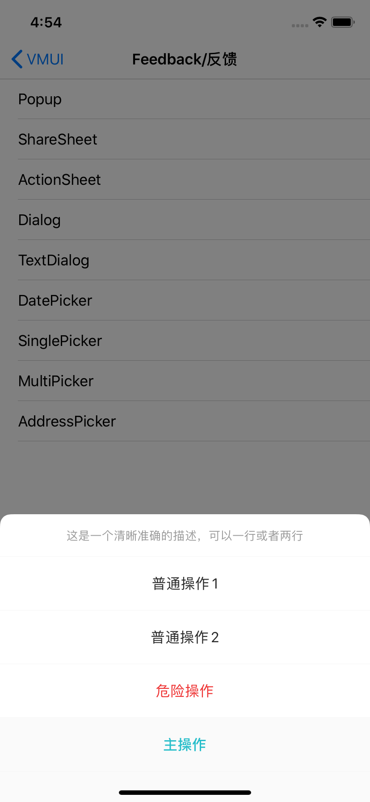

#### 使用示例

```java
   VMUIActionSheet *actionSheet = [[VMUIActionSheet alloc]initWithTitle:@"这是一个清晰准确的描述，可以一行或者两行"];
    __weak __typeof(self) weakSelf = self;
    [actionSheet addItem:[VMUIActionSheetItem itemWithTitle:@"普通操作1" style:VMUIActionSheetItemStypeNormal handler:^(VMUIActionSheetItem * _Nonnull action) {
        __strong __typeof(self) strongSelf = weakSelf;
        [strongSelf.view makeToast:[NSString stringWithFormat:@"选择了%@",action.title]];
    }]];
    [actionSheet addItem:[VMUIActionSheetItem itemWithTitle:@"普通操作2" style:VMUIActionSheetItemStypeNormal handler:^(VMUIActionSheetItem * _Nonnull action) {
        __strong __typeof(self) strongSelf = weakSelf;
        [strongSelf.view makeToast:[NSString stringWithFormat:@"选择了%@",action.title]];
    }]];
    [actionSheet addItem:[VMUIActionSheetItem itemWithTitle:@"危险操作" style:VMUIActionSheetItemStypeDanger handler:^(VMUIActionSheetItem * _Nonnull action) {
        __strong __typeof(self) strongSelf = weakSelf;
        [strongSelf.view makeToast:[NSString stringWithFormat:@"选择了%@",action.title]];
    }]];
    [actionSheet addItem:[VMUIActionSheetItem itemWithTitle:@"主操作" style:VMUIActionSheetItemStypeMain handler:^(VMUIActionSheetItem * _Nonnull action) {
        __strong __typeof(self) strongSelf = weakSelf;
        [strongSelf.view makeToast:[NSString stringWithFormat:@"选择了%@",action.title]];
    }]];
    [actionSheet show:nil];
```


####主要属性和方法

```
/// <#Description#>
/// @param config UI配置类
/// @param title 标题
- (instancetype)initWithConfig:(VMUIActionSheetConfig *)config title:(NSString *)title;


/// <#Description#>
/// @param title 标题
- (instancetype)initWithTitle:(NSString *)title;

/// <#Description#>
/// @param item 操作选项类
- (void)addItem:(VMUIActionSheetItem *)item;
```

操作选项类VMUIActionSheetItem属性

| Name    | Type                               | Description                                                  |
| ------- | ---------------------------------- | ------------------------------------------------------------ |
| style   | VMUIActionSheetItemStype           | 选项风格枚举，VMUIActionSheetItemStypeMain、VMUIActionSheetItemStypeNormal、VMUIActionSheetItemStypeDanger |
| title   | NSString                           | 标题                                                         |
| handler | void(^)(VMUIActionSheetItem *item) | 选项点击回调                                                 |


UI配置类VMUIActionSheetConfig属性

| Name             | Type                      | Description  |
| ---------------- | ------------------------- | ------------ |
| titleConfig      | VMUIActionSheetItemConfig | 标题配置     |
| mainItemConfig   | VMUIActionSheetItemConfig | 主选项配置   |
| dangerItemConfig | VMUIActionSheetItemConfig | 警告选项配置 |
| normalItemCofig  | VMUIActionSheetItemConfig | 普通选项配置 |


选型配置类VMUIActionSheetItemConfig属性

| Name             | Type    | Description  |
| ---------------- | ------- | ------------ |
| color_item       | UIColor | 选项颜色     |
| font_item        | UIFont  | 选项字体     |
| color_background | UIColor | 选项背景颜色 |


#### 预览

