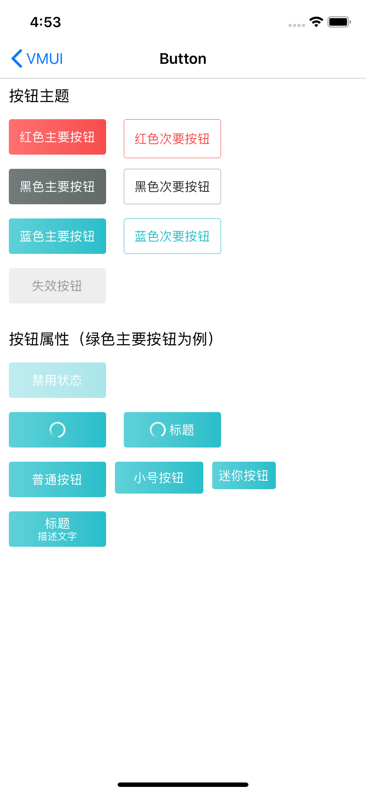

#### 使用方法

```
     VMUIButton *redMinorButton=[[VMUIButton alloc] initWithFrame:CGRectMake(0, 100, 110, 44) theme:VMUIButtonThemeMinorRed];
     [redMinorButton setTitle:@"红色次要按钮" forState:(UIControlStateNormal)];
     [self.view addSubview:redMinorButton];
     width= redMinorButton.frame.size.width;
     height = redMinorButton.frame.size.height;
     [redMinorButton mas_makeConstraints:^(MASConstraintMaker *make) {
         make.top.equalTo(topRefer).with.offset(16);
         make.left.equalTo(rightRefer).with.offset(20);
         make.width.mas_equalTo(width);
         make.height.mas_equalTo(height);
     }];
     topRefer=redMainButton.mas_bottom;
```

#### 主要属性

| Name        | Type   | Description                                                  |
| ----------- | ------ | ------------------------------------------------------------ |
| theme       | NSEnum   | 按钮样式: VMUIButtonThemeMainRed、VMUIButtonThemeMinorRed、VMUIButtonThemeMainBlue、VMUIButtonThemeMinorBlue、VMUIButtonThemeMainBlack、VMUIButtonThemeMinorBlack、VMUIButtonThemeInvalid |
| button_size | NSEnum | 按钮尺寸：VMUIButtonSizeDefault、VMUIButtonSizeSmall、VMUIButtonSizeMini |
| subTitle    | NSString | 副标题                                                       |
|             |        | 其余属性参考系统UIButton用法                                 |

#### 预览

