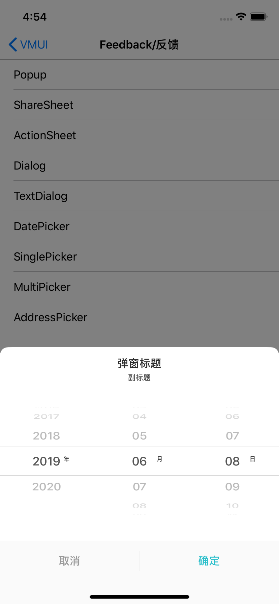

#### 使用示例

```
    VMUIDateHelperModel *model = [VMUIDateHelperModel modelWithYMDString:@"20190608"];
    __weak __typeof(self) weakSelf = self;
    VMUIDatePicker *datePicker = [[VMUIDatePicker alloc]initWithMode:VMUIDatePickerModeYearMonthDay title:@"弹窗标题" subTitle:@"副标题" initialDate:[model currentDate] maxDate:[NSDate new] complete:^(NSDate * _Nonnull date) {
        __strong __typeof(self) strongSelf = weakSelf;
        VMUIDateHelperModel *tempModel = [VMUIDateHelperModel modelWithDate:date];
        [strongSelf.view makeToast:[NSString stringWithFormat:@"时间：%@",[tempModel currentYMDString]]];
    }];
    [datePicker show:nil];
```


#### 主要属性

| Name        | Type                   | Description                                                  |
| ----------- | ---------------------- | ------------------------------------------------------------ |
| mode        | VMUIDatePickerMode     | 时间选择器列类型，VMUIDatePickerModeDay、VMUIDatePickerModeMonthDay、VMUIDatePickerModeYearMonthDay |
| title       | NSString               | 弹窗标题                                                     |
| subTitle    | NSString               | 副标题                                                       |
| initialDate | NSDate                 | 初始化日期                                                   |
| maxDate     | NSDate                 | 时间范围最大日期，默认为[NSDate new]，如果设置了不为nil则按maxDate走 |
| block       | void (^)(NSDate *date) | 点击确定后回调block                                          |


####预览

