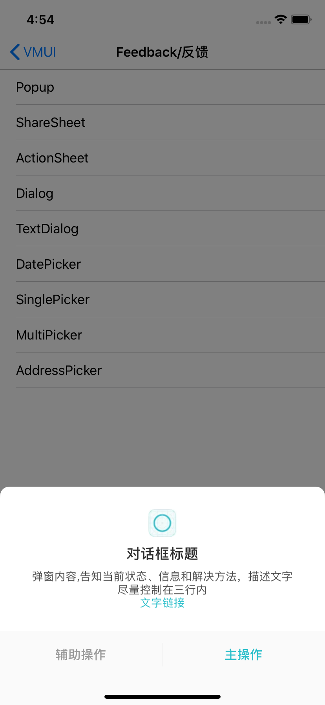

#### 使用示例

```
    NSString *string = @"弹窗内容,告知当前状态、信息和解决方法，描述文字尽量控制在三行内\r\n文字链接";
    NSMutableAttributedString *attributeString = [[NSMutableAttributedString alloc]initWithString:string];
    
    NSMutableParagraphStyle *style = [NSMutableParagraphStyle new];
    style.alignment =  NSTextAlignmentCenter;
    [attributeString addAttributes:@{NSFontAttributeName:[UIFont vmui_systemFontOfSize:14],NSParagraphStyleAttributeName:style} range:[string rangeOfString:string]];
    [attributeString addAttributes:@{NSForegroundColorAttributeName:RGBOF(0x4C4C4C, 1.0)} range:[string rangeOfString:@"弹窗内容,告知当前状态、信息和解决方法，描述文字尽量控制在三行内"]];
    [attributeString addAttribute:NSLinkAttributeName value:@"viot://" range:[string rangeOfString:@"文字链接"]];
 
    VMUIDialog *dialog = [[VMUIDialog alloc]initWithImage:[UIImage imageNamed:@"icon_tabbar_select"] title:@"对话框标题" attributeContentString:[attributeString copy] delegate:self];
    __weak __typeof(self) weakSelf = self;
    [dialog addOperationItem:[VMUIDialogBarItem itemWithTitle:@"辅助操作" style:VMUIDialogBarItemStyleAssist handler:^(VMUIDialogBarItem * _Nonnull action) {
        __strong __typeof(self) strongSelf = weakSelf;
        [strongSelf.view makeToast:@"点击了辅助操作"];
    }]];
    
    [dialog addOperationItem:[VMUIDialogBarItem itemWithTitle:@"主操作" style:VMUIDialogBarItemStyleMain handler:^(VMUIDialogBarItem * _Nonnull action) {
         __strong __typeof(self) strongSelf = weakSelf;
        [strongSelf.view makeToast:@"点击了主操作"];
    }]];
    
    [dialog show:nil];
```


####  主要属性和方法

```
/// <#Description#>
/// @param image 弹窗Icon
/// @param titleString 弹窗标题
/// @param attributeContentString 弹窗内容
/// @param delegate 弹窗内容点击回调代理
- (instancetype)initWithImage:(nullable UIImage *)image title:(NSString *)titleString attributeContentString:(NSAttributedString *)attributeContentString delegate:(nullable id<VMUIDialogDelegate>)delegate;


/// 添加操作按钮
/// @param item <#item description#>
- (void)addOperationItem:(VMUIDialogBarItem *)item;
```


UI配置类主要属性

| Name                  | Type    | Description                          |
| --------------------- | ------- | ------------------------------------ |
| fPopupViewHeight      | CGFloat | 弹窗高度，内部根据内容计算而得       |
| bDismissWhenTouchMask | CGFloat | 点击背景遮罩是否可以取消             |
| bAutoAdaptSafeArea    | BOOL    | 是否自动填充安全区域高度             |
| bShowCloseBtn         | BOOL    | 是否展示关闭按钮                     |
| color_safeArea        | UIColor | 自动填充安全区域的颜色，默认同背景色 |


#### 预览

