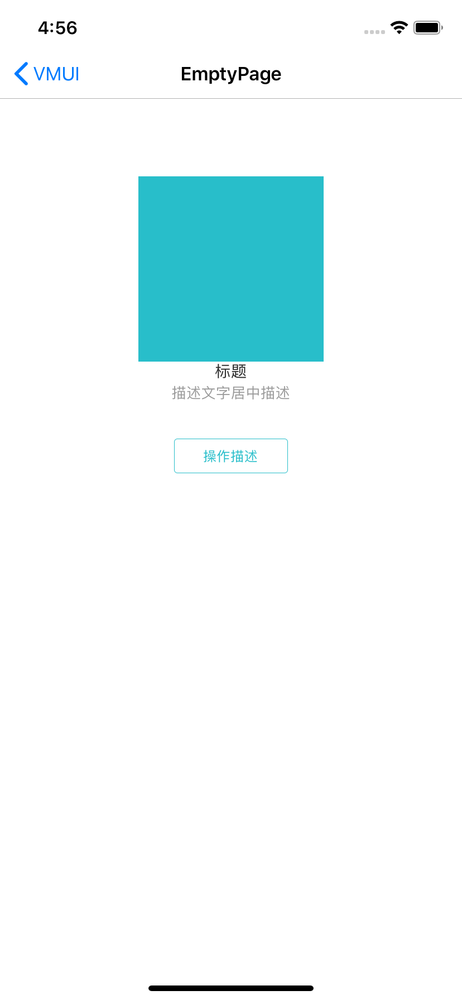

#### 使用示例

```
- (VMUIEmptyView *)emptyView{
    if(!_emptyView){
        _emptyView = [VMUIEmptyView new];
        _emptyView.sTitle = @"标题";
        _emptyView.sSubTitle = @"描述文字居中描述";
        UIImage *image = [self imageForColor:RGBOF(0x28BECA, 1.0) size:CGSizeMake(200, 200)];
        [_emptyView setEmptyImage:image];
        __weak __typeof(self) weakSelf = self;
        [_emptyView setButtonTitle:@"操作描述" action:^(VMUIEmptyView * _Nonnull view) {
            __strong __typeof(self) strongSelf = weakSelf;
            [strongSelf.navigationController popViewControllerAnimated:YES];
        }];
    }
    return _emptyView;
}
```


#### 主要属性和方法

| Name           | Type     | Description                   |
| -------------- | -------- | ----------------------------- |
| emptyImage     | UIImage  | 图片                          |
| sTitle         | NSString | 标题文字                      |
| sSubTitle      | NSString | 副标题文字                    |
| label_subTitle | UILabel  | 副标题Label，可改颜色、字体等 |

```
/// 设置按钮问题和按钮点击回调
/// @param btnTitle 按钮文字
/// @param actionBlock 回调响应Block
- (void)setButtonTitle:(NSString *)btnTitle action:(void (^)(VMUIEmptyView *view))actionBlock;
```


####预览

