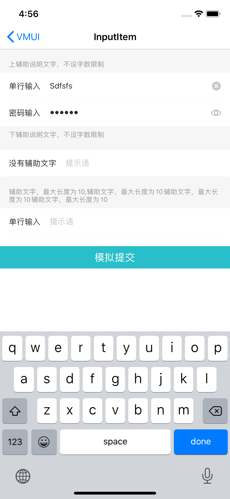
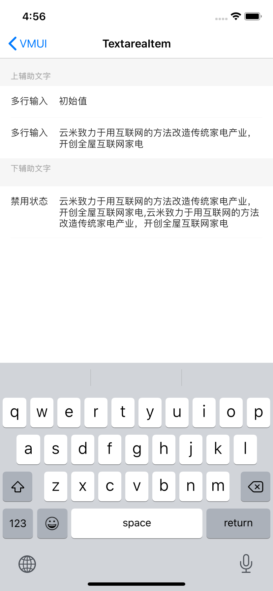
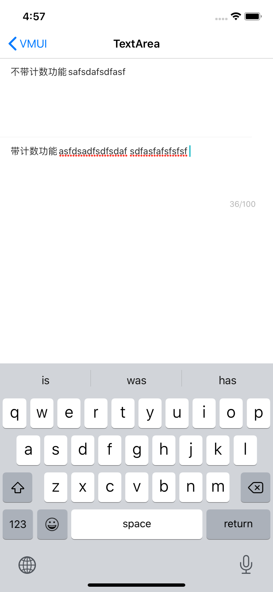

---

title: InputItem
date: 2019-11-29 14:48:33
tags:
---

InputItem根据使用场景分为，VMUIInputItemView、VMUITextareItemView、VMUITextAreaView三类

####1. VMUIInputItemView类

#####使用示例

```
    VMUIInputItemView *inputItem2 = [VMUIInputItemView new];
    inputItem2.sBelowAssist = @"下辅助说明文字，不设字数限制";
    inputItem2.sPlaceHolderString = @"提示语";
    inputItem2.sTitle = @"密码输入";
    inputItem2.bPasswordSwitch = YES;
    self.inputItem2 = inputItem2;
    
    [self.view addSubview:inputItem2];
    [inputItem2 mas_makeConstraints:^(MASConstraintMaker *make) {
        make.left.right.equalTo(self.view);
        make.top.equalTo(inputItem1.mas_bottom);
    }];
```


#####主要属性和方法

| Name               | Type                     | Description                                  |
| ------------------ | ------------------------ | -------------------------------------------- |
| textField          | VMUINormalItemViewConfig | 输入文本框                                   |
| sTitle             | NSString                 | 左标题                                       |
| sPlaceHolderString | NSString                 | 左副标题                                     |
| sInitialString     | NSString                 | 初始化字符串                                 |
| bPasswordSwitch    | NSString                 | 右副标题，当右边只有一个标题是，使用这个属性 |
| bPasswordFlag      | UIImage                  | 当前是否密码输入                             |
| sAboveAssist       | E_VMUIItemImagePosition  | 上辅助文字                                   |
| sBelowAssist       | E_VMUIItemImportance     | 下辅助文字                                   |
| bEditable          | E_VMUIItemImageSize      | 是否可编辑                                   |
| iMinLength         | BOOL                     | 最小输入长度                                 |
| iMaxLength         | NSUInteger               | 最大输入长度                                 |
| sCurrentText       | BOOL                     | 获取当前输入文本                             |

```
/// 展示错误样式
- (BOOL)tryToCheckError;

/// 输入是否合法
- (BOOL)inputIsValid;

/// 展示分割线
/// @param flag <#flag description#>
- (void)displayBottomLine:(BOOL)flag;

/// 成为焦点
- (void)becomeFirstResponder;

/// 取消焦点
- (void)resignFirstResponder;
```


#####预览




####2. VMUITextareItemView类

#####使用示例

```
    self.itemView3 = [VMUITextareaItemView new];
    self.itemView3.sPlaceHolderString = @"占位字符串";
    self.itemView3.sInitialString = @"云米致力于用互联网的方法改造传统家电产业，开创全屋互联网家电,云米致力于用互联网的方法改造传统家电产业，开创全屋互联网家电";
    self.itemView3.sTitle = @"禁用状态";
    self.itemView3.bEditable = NO;
    [self.view addSubview:self.itemView3];
    [self.itemView3 mas_makeConstraints:^(MASConstraintMaker *make) {
        make.top.equalTo(self.itemView2.mas_bottom);
        make.left.right.equalTo(self.view);
    }];
```


#####主要属性

| Name               | Type                    | Description                                                  |
| ------------------ | ----------------------- | ------------------------------------------------------------ |
| textView           | VMUITextView            | 输入类VMUITextView                                           |
| sTitle             | NSString                | 标题                                                         |
| sPlaceHolderString | NSString                | 占位字符串                                                   |
| sInitialString     | NSString                | 初始化字符串                                                 |
| sAboveAssist       | NSString                | 右副标题，当右边只有一个标题是，使用这个属性                 |
| sBelowAssist       | NSString                | 下标题                                                       |
| bEditable          | E_VMUIItemImagePosition | 图片位置枚举E_VMUIItemImagePosition_Left、E_VMUIItemImagePosition_Right |
| sCurrentText       | E_VMUIItemImportance    | 获取当前输入                                                 |

方法同VMUIInputItemView


#####预览



   


####3. VMUITextAreaView类

#####使用示例

```
    self.textArea1 = [VMUITextAreaView new];
    [self.textArea1 displayBottomLine:YES];
    self.textArea1.sInitialString = @"不带计数功能";
    self.textArea1.sPlaceHolder = @"不带计数功能";
    
    [self.view addSubview:self.textArea1];
    [self.textArea1 mas_makeConstraints:^(MASConstraintMaker *make) {
        make.left.top.right.equalTo(self.view);
        make.height.mas_equalTo(120);
    }];
    
    self.textArea2 = [VMUITextAreaView new];
    self.textArea2.iMaxInputLength = 100;
    [self.textArea2 displayBottomLine:NO];
    self.textArea2.sPlaceHolder = @"带计数功能";
    self.textArea2.sInitialString = @"带计数功能";
    
    [self.view addSubview:self.textArea2];
    [self.textArea2 mas_makeConstraints:^(MASConstraintMaker *make) {
        make.top.equalTo(self.textArea1.mas_bottom);
        make.left.right.equalTo(self.view);
        make.height.mas_equalTo(120);
    }];
```


#####主要属性

| Name            | Type         | Description                          |
| --------------- | ------------ | ------------------------------------ |
| textView_input  | VMUITextView | UI配置类                             |
| sInitialString  | NSString     | 初始化字符串                         |
| sPlaceHolder    | NSString     | 占位字符串                           |
| bEditable       | BOOL         | 是否可以编辑                         |
| sCurrentText    | NSString     | 获取当前输入文本                     |
| iMaxInputLength | NSUInteger   | 当设置了最大输入长度，会开启计数功能 |

方法同VMUIInputItemView


#####预览




