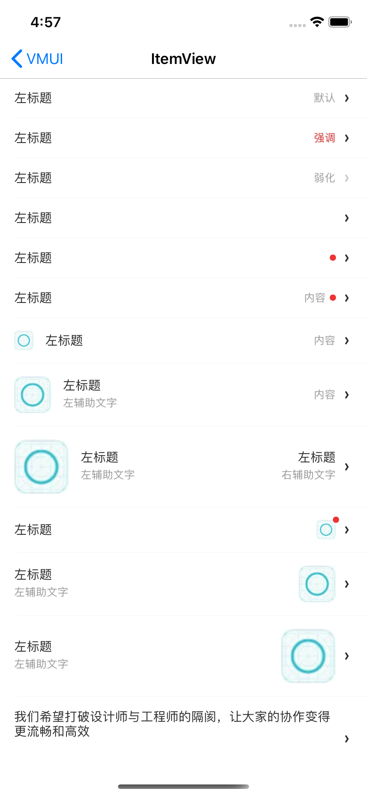
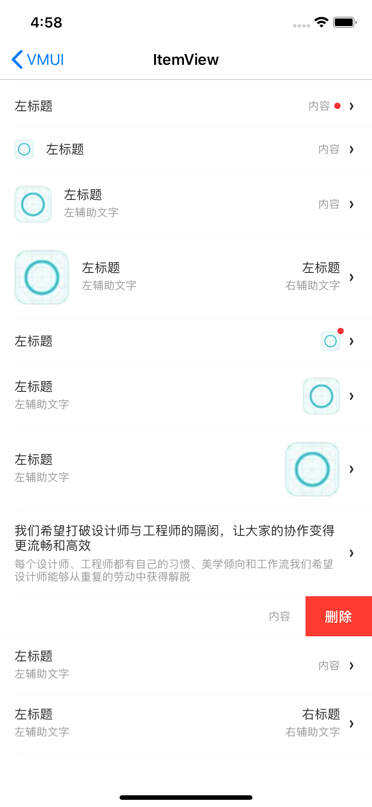
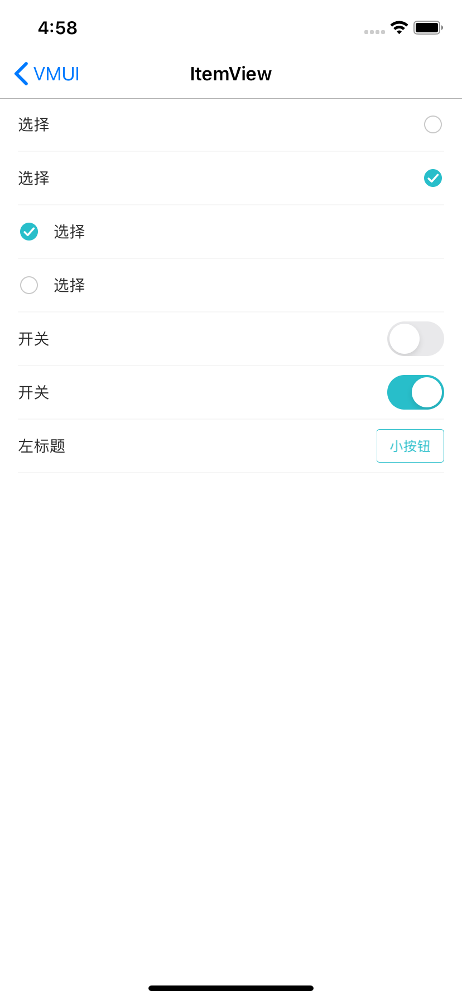

---

title: ItemView
date: 2019-11-29 14:48:33
tags:
---

ItemView分两种类型，分展示类和交互类，都是继承自VMUIBaseItemView父类。

####1. 展示类VMUINormalItemView

#####使用示例

```
- (void)fillData:(DemoItemCellModel *)model{
    self.itemView.sLeftTitle = model.sLeftTitle;
    self.itemView.sLeftSubTitle = model.sLeftSubTitle;
    self.itemView.sRightTitle = model.sRightTitle;
    self.itemView.sRightSubTitle = model.sRightSubTitle;
    self.itemView.iconImage = model.iconImage;
    self.itemView.bOnlyShowLeftText = model.bOnlyShowLeftText;
    self.itemView.iImagePosition = model.iImagePosition;
    self.itemView.viewConfig = model.viewConfig;
    self.itemView.iItemImportance = model.iItemImportance;
    self.itemView.iItemImageSize = model.iItemImageSize;
    self.itemView.bShowArrow = model.bShowArrow;
    self.itemView.bShowReddot = model.bShowReddot;
}

- (VMUINormalItemView*)itemView{
    if (!_itemView) {
        _itemView = [VMUINormalItemView new];
    }
    return _itemView;
}
```


#####主要属性

| Name              | Type                     | Description                                                  |
| ----------------- | ------------------------ | ------------------------------------------------------------ |
| viewConfig        | VMUINormalItemViewConfig | UI配置类                                                     |
| sLeftTitle        | NSString                 | 左标题                                                       |
| sLeftSubTitle     | NSString                 | 左副标题                                                     |
| sRightTitle       | NSString                 | 左标题                                                       |
| sRightSubTitle    | NSString                 | 右副标题，当右边只有一个标题是，使用这个属性                 |
| iconImage         | UIImage                  | 右标题字体                                                   |
| iImagePosition    | E_VMUIItemImagePosition  | 图片位置枚举E_VMUIItemImagePosition_Left、E_VMUIItemImagePosition_Right |
| iItemImportance   | E_VMUIItemImportance     | 样式枚举E_VMUIItemImportance_Normal、E_VMUIItemImportance_Strong、E_VMUIItemImportance_Weak |
| iItemImageSize    | E_VMUIItemImageSize      | 图片大小枚举E_VMUIItemImageSize_Min、E_VMUIItemImageSize_Middle、E_VMUIItemImageSize_Max |
| bShowArrow        | BOOL                     | 是否展示箭头                                                 |
| bOnlyShowLeftText | BOOL                     | 是否只展示左单侧文字                                         |
| bShowReddot       | BOOL                     | 是否展示红点提示，内部根据文本还是图片决定红点位置           |


UI配置类VMUINormalItemViewConfig属性

| Name                | Type    | Description  |
| ------------------- | ------- | ------------ |
| color_leftTitle     | UIColor | 左标题颜色   |
| font_leftTitle      | UIFont  | 左标题字体   |
| color_leftSubTitle  | UIColor | 左副标题颜色 |
| font_leftSubTitle   | UIFont  | 左副标题字体 |
| color_rightTitle    | UIColor | 右标题颜色   |
| font_rightTitle     | UIFont  | 右标题字体   |
| color_rightSubTitle | UIColor | 右副标题颜色 |
| font_rightSubTitle  | UIFont  | 右副标题字体 |
| image_more          | UIImage | 更多箭头图片 |


#####预览



   


####2. 交互类类VMUISwitchItemView、VMUIButtonItemView

#####使用示例

```
    {
        VMUISwitchItemView *view = [VMUISwitchItemView new];
        view.sTitle = @"开关";
        view.iItemType = E_VMUISwitchItemType_System;
        [view displayBottomLine:YES];
        [self.view addSubview:view];
        [view mas_makeConstraints:^(MASConstraintMaker *make) {
            make.left.right.equalTo(self.view);
            make.top.equalTo(lastView.mas_bottom);
            make.height.mas_equalTo(48);
        }];
        lastView = view;
    }
    {
        VMUIButtonItemView *view = [VMUIButtonItemView new];
        view.sTitle = @"左标题";
        view.sButtonTitle = @"小按钮";
        [view displayBottomLine:YES];
        [self.view addSubview:view];
        [view mas_makeConstraints:^(MASConstraintMaker *make) {
            make.left.right.equalTo(self.view);
            make.top.equalTo(lastView.mas_bottom);
            make.height.mas_equalTo(48);
        }];
        lastView = view;
    }
```


##### VMUISwitchItemView类主要属性

| Name          | Type                       | Description                                                  |
| ------------- | -------------------------- | ------------------------------------------------------------ |
| delegate      | VMUISwitchItemViewDelegate | 操作代理                                                     |
| bOn           | BOOL                       | 当前开关状态                                                 |
| sTitle        | NSString                   | 标题                                                         |
| image_turnOn  | UIImage                    | 开启状态的图片                                               |
| image_turnOff | UIImage                    | 关闭状态的图片                                               |
| iItemType     | E_VMUISwitchItemType       | 开关的类型枚举，E_VMUISwitchItemType_Image、E_VMUISwitchItemType_System |
| iItemPosition | E_VMUIItemImagePosition    | 开关的位置枚举，E_VMUISwitchItemPostion_Left、E_VMUISwitchItemPostion_Right，当是系统开关类型时不起效 |


##### VMUIButtonItemView类主要属性

| Name         | Type                       | Description |
| ------------ | -------------------------- | ----------- |
| delegate     | VMUIButtonItemViewDelegate | 操作代理    |
| sTitle       | NSString                   | 标题        |
| sButtonTitle | NSString                   | 按钮标题    |


#####预览




