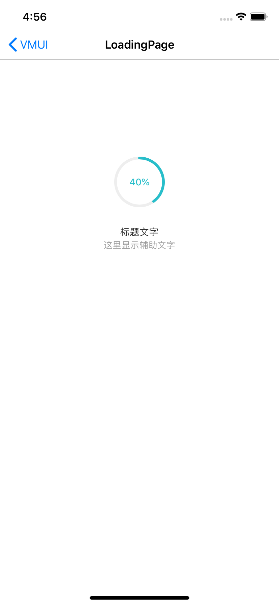

#### 使用示例

```xml
[self.view_loading.view_circleProgress setFProgress:0.4];
dispatch_after(dispatch_time(DISPATCH_TIME_NOW, (int64_t)(2 * NSEC_PER_SEC)), dispatch_get_main_queue(), ^{
    [self.view_loading.view_circleProgress setFProgress:1];
});


- (VMUIProgressView *)view_loading{
    if (!_view_loading) {
        _view_loading = [VMUIProgressView new];
        _view_loading.sTitle = @"标题文字";
        _view_loading.sSubTitle = @"这里显示辅助文字";
    }
    return _view_loading;
}
```


#### 主要属性和方法

| Name                | Type                   | Description    |
| ------------------- | ---------------------- | -------------- |
| view_circleProgress | VMUICircleProgressView | 圆形进度条类   |
| circleSize          | CGSize                 | 圆形进度条大小 |
| sTitle              | NSString               | 标题文字       |
| sSubTitle           | NSString               | 副标题文字     |
| label_subTitle      | UILabel                | 副标题Label    |


VMUICircleProgressView类主要属性

| Name                 | Type    | Description     |
| -------------------- | ------- | --------------- |
| color_pathBackground | UIColor | 进度条背景颜色  |
| color_pathForeground | UIColor | 进度条颜色      |
| fStrokeWidth         | CGFloat | 进度条宽度      |
| fProgress            | CGFloat | 0-1，进度条进度 |


####预览

