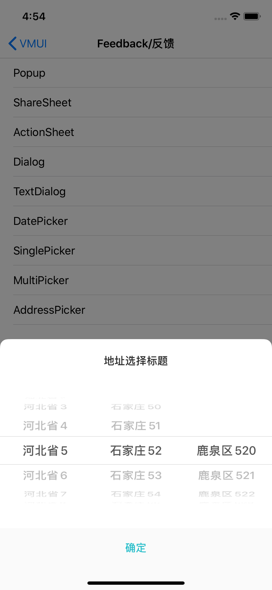

---

title: LocationPicker
date: 2019-11-25 16:41:24
tags:
---

#### 使用示例


```java
    NSArray *array = [self makeAddress:@"河北省"];
    NSInteger i = 0;
    for (VMUIAddressPickerModel* model in array) {
        model.arr_netxtAreaModel = [self makeAddress:[NSString stringWithFormat:@"石家庄%ld",i]];
        i++;
    }
    
    NSInteger j = 0;
    for (VMUIAddressPickerModel *model in array) {
        for (VMUIAddressPickerModel *subModel in model.arr_netxtAreaModel) {
            subModel.arr_netxtAreaModel = [self makeAddress:[NSString stringWithFormat:@"鹿泉区%ld",j]];
            j++;
        }
    }
    
    __weak __typeof(self) weakSelf = self;
    VMUIAddressPickerView *pickerView = [[VMUIAddressPickerView alloc]initWithTitle:@"地址选择标题" array:array complete:^(NSInteger areaCode, NSString * _Nonnull areaName) {
        __strong __typeof(self) strongSelf = weakSelf;
        [strongSelf.view makeToast:[NSString stringWithFormat:@"code:%ld name:%@",areaCode,areaName]];
    }];
    [pickerView show:nil];
```


#### 主要属性

| Name           | Type                                            | Description                                    |
| -------------- | ----------------------------------------------- | ---------------------------------------------- |
| title          | NSString                                        | 弹窗标题                                       |
| areaModelArray | NSArray                                         | 实现VMUIAddressAreaModelProtocol的地址选项数组 |
| block          | void (^)(NSInteger areaCode,NSString *areaName) | 点击确定回调block                              |


####预览

