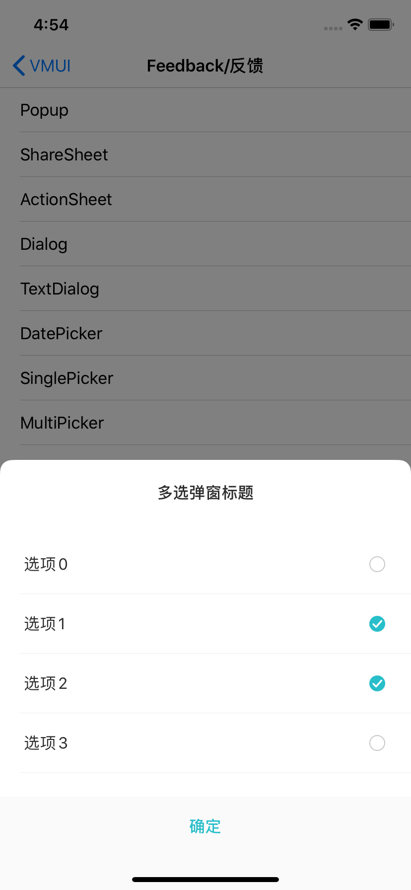

#### 使用示例

```
    NSMutableArray *array = [NSMutableArray new];
    for (NSInteger i = 0; i < 10; i++) {
        VMUIMultiPickerTestMode *model = [VMUIMultiPickerTestMode new];
        model.sTitle = [NSString stringWithFormat:@"选项%ld",(long)i];
        [array addObject:model];
    }
    __weak __typeof(self) weakSelf = self;
    VMUIMultiPickerView *pickerView = [[VMUIMultiPickerView alloc]initWithTitle:@"多选弹窗标题" radio:NO items:array complete:^(NSArray<id<VMUIMultiPickerModelDelegate>> * _Nonnull selectItems) {
        __strong __typeof(self) strongSelf = weakSelf;
        NSArray *array = [selectItems valueForKeyPath:@"sTitle"];
        NSString *string = [array componentsJoinedByString:@","];
        [strongSelf.view makeToast:string];
    }];
    [pickerView show:nil];
```


#### 主要属性

| Name   | Type                           | Description                                |
| ------ | ------------------------------ | ------------------------------------------ |
| sTitle | NSString                       | 弹窗标题                                   |
| bRadio | BOOL                           | 是否开启单选模式                           |
| items  | NSArray                        | 实现VMUIMultiPickerModelDelegate的选项数组 |
| block  | void (^)(NSArray* selectItems) | 点击确定后回调block                        |


#### 预览

