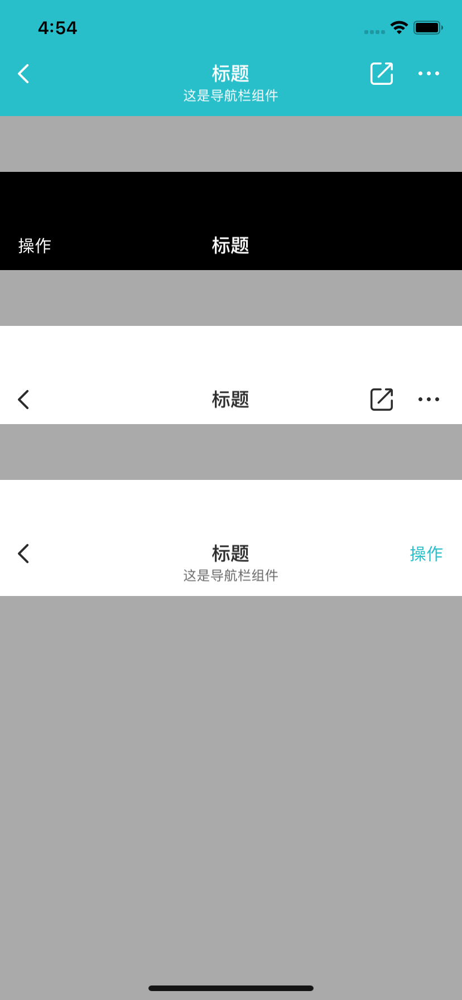

#### 使用示例

```xml
        VMUINavBar *bar = [[VMUINavBar alloc]initWithStyle:VMUINavBarStyleLight];
        bar.sTitle = @"标题";
        bar.subTitle = @"这是导航栏组件";
        
        UIButton *backButton = [UIButton new];
        [backButton setImage:[UIImage imageNamed:@"icon_navbar_back_bk"] forState:UIControlStateNormal];
        [backButton addTarget:self action:@selector(backAction) forControlEvents:UIControlEventTouchUpInside];
        
        UIButton *operationBtn = [UIButton new];
        [operationBtn setTitle:@"操作" forState:UIControlStateNormal];
        operationBtn.titleLabel.font = [UIFont vmui_systemFontOfSize:15];
        [operationBtn setTitleColor:RGBOF(0x28BECA, 1.0) forState:UIControlStateNormal];
        
        bar.arr_leftBarButton = @[backButton];
        bar.arr_rightBarButton = @[operationBtn];
        
        [self.view addSubview:bar];
```

#### 主要属性和方法

| Name               | Type                  | Description                                                  |
| ------------------ | --------------------- | ------------------------------------------------------------ |
| style              | enum                  | 主题样式：VMUINavBarStyleDart，VMUINavBarStyleLight缺省：VMUINavBarStyleLight |
| sTtile             | NSString              | 主标题                                                       |
| subTitle           | NSString              | 副标题                                                       |
| fBarHeight         | CGFloat               | 返回计算好的高度                                             |
| arr_leftBarButton  | string                | 左边按钮数组，对象只要是UIButton类即可                       |
| arr_rightBarButton | reference             | 右边按钮数组，对象只要是UIButton类即可                       |
| showLoading()      | Void                  | 开始展示loading                                              |
| stopLoading()      | Void                  | 停止展示loading                                              |
| config             | VMUINavBarStyleConfig | UI配置类                                                     |

VMUINavBarStyleConfig辅助类主要属性

| Name             | Type    | Description |
| ---------------- | ------- | ----------- |
| color_background | UIColor | 背景颜色    |
| font_title       | UIFont  | 主标题字体  |
| font_subTitle    | UIFont  | 副标题字体  |
| color_title      | UIColor | 主标题颜色  |
| color_subTitle   | UIColor | 副标题颜色  |


#### 预览

