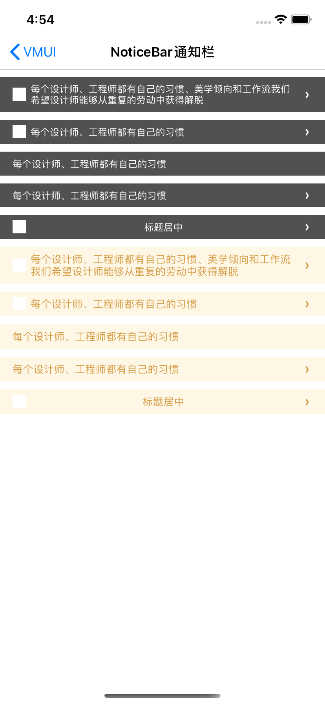

####使用方法

```objective-c
VMUINoticeBarConfig *lightConfig = [VMUINoticeBarConfig generateByStyle:VMUINoticeBarStyleDark];
lightConfig.textAlignment = NSTextAlignmentCenter;
VMUINoticeBar *bar = [[VMUINoticeBar alloc]initWithConfig:lightConfig leftImage:[UIImage imageNamed:@"icon_loading_white"] text:@"标题居中" showArrow:YES delegate:nil];
[self.view addSubview:bar];
[bar mas_makeConstraints:^(MASConstraintMaker *make) {
       make.centerX.equalTo(self.view);
       make.top.equalTo(lastBar.mas_bottom).with.offset(10);
}];
```

#####

####主要属性

| Name             | Type    | Description |
| ---------------- | ------- | ----------- |
| color_background | UIColor | 背景颜色    |
| font_title       | UIFont  | 主标题字体  |
| font_subTitle    | UIFont  | 副标题字体  |
| color_title      | UIColor | 主标题颜色  |
| color_subTitle   | UIColor | 副标题颜色  |

UI配置类属性：

| Name            | Type            | Description      |
| --------------- | --------------- | ---------------- |
| color_barBg     | UIColor         | 背景颜色         |
| color_text      | UIFont          | 通知文本颜色     |
| font_text       | UIFont          | 通知文本字体     |
| sArrowImageName | UIColor         | 指示器图片       |
| textAlignment   | NSTextAlignment | 通知文本对齐方式 |


####预览

