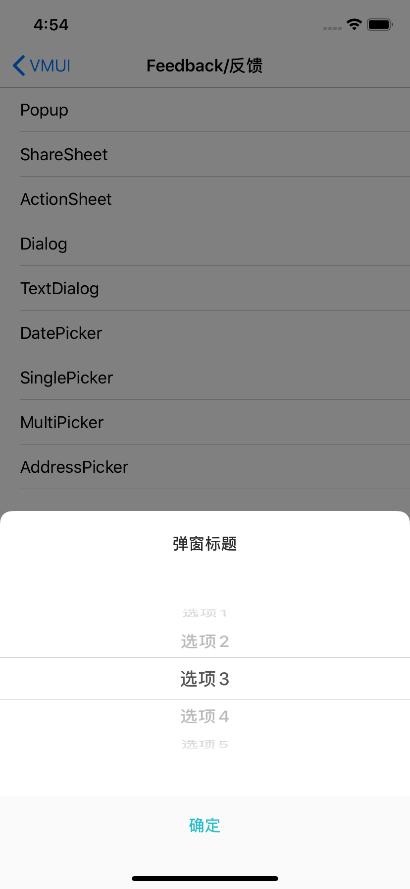

#### 使用示例

```
    __weak __typeof(self) weakSelf = self;
    VMUISinglePickerView *pickView = [[VMUISinglePickerView alloc]initWithTitle:@"弹窗标题" items:@[@"选项1",@"选项2",@"选项3",@"选项4",@"选项5"] defaultItem:@"选项3" complete:^(NSString * _Nonnull item) {
        __strong __typeof(self) strongSelf = weakSelf;
        [strongSelf.view makeToast:[NSString stringWithFormat:@"选中项：%@",item]];
    }];
    [pickView show:nil];
```


#### 主要属性

| Name        | Type                     | Description   |
| ----------- | ------------------------ | ------------- |
| sTitle      | NSString                 | 弹窗标题      |
| Item        | NSArray<NSString *>      | 选项数组      |
| defaultItem | NSString                 | 默认选中项    |
| block       | void (^)(NSString *item) | 选中回调block |


####预览

