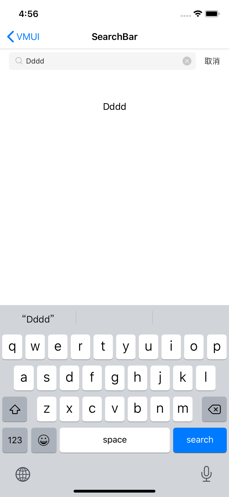

#### 使用示例

```
#pragma mark ---------- VMUISearchBarDelegate
- (void)searchBar:(VMUISearchBar *)searchBar textDidChange:(nullable NSString *)searchText{
    self.label.text = searchText;
}

#pragma mark ---------- setter && getter
- (VMUISearchBar *)searchBar{
    if(!_searchBar) {
        _searchBar = [VMUISearchBar new];
        _searchBar.sPlaceHolderText = @"预设信息";
        _searchBar.delegate = self;
        _searchBar.bAutoFocus = YES;
        _searchBar.bShowClearButtonWhenEditing = YES;
        _searchBar.bShowCancelButtonAlways = NO;
    }
    return _searchBar;
}
```


#### 主要属性

| Name                        | Type                  | Description                  |
| --------------------------- | --------------------- | ---------------------------- |
| delegate                    | VMUISearchBarDelegate | 搜索栏操作代理               |
| sPlaceHolderText            | color                 | 占位文本                     |
| sCurrentText                | dimension             | 取消键的文字大小             |
| bAutoFocus                  | color                 | 是否自动对齐焦点             |
| bShowCancelButtonAlways     | dimension             | 是否一直显示取消按钮         |
| bShowClearButtonWhenEditing | string                | 当编辑的时候是否显示清除按钮 |

VMUISearchBarDelegate 主要方法

```
/// 是否允许开始编辑
/// @param searchBar <#searchBar description#>
- (BOOL)searchBarShouldBeginEditing:(VMUISearchBar *)searchBar;


/// 开始编辑回调
/// @param searchBar <#searchBar description#>
- (void)searchBarTextDidBeginEditing:(VMUISearchBar *)searchBar;

/// 是否允许结束编辑
/// @param searchBar <#searchBar description#>
- (BOOL)searchBarShouldEndEditing:(VMUISearchBar *)searchBar;

/// 结束编辑回调
/// @param searchBar <#searchBar description#>
- (void)searchBarTextDidEndEditing:(VMUISearchBar *)searchBar;

/// 内部已监听输入变化
/// @param searchBar <#searchBar description#>
/// @param searchText <#searchText description#>
- (void)searchBar:(VMUISearchBar *)searchBar textDidChange:(nullable NSString *)searchText;

/// 是否允许文本变化
/// @param searchBar <#searchBar description#>
/// @param range <#range description#>
/// @param text <#text description#>
- (BOOL)searchBar:(VMUISearchBar *)searchBar shouldChangeTextInRange:(NSRange)range replacementText:(nullable NSString *)text;

/// 回车回调
/// @param searchBar <#searchBar description#>
- (void)searchBarSearchButtonClicked:(VMUISearchBar *)searchBar;

/// 取消回调
/// @param searchBar <#searchBar description#>
- (void)searchBarCancelButtonClicked:(VMUISearchBar *)searchBar;
```


####预览

