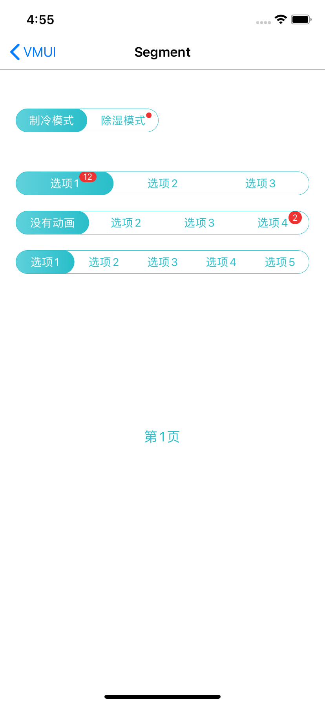

##### 

####使用方法

```xml
VMUISegmentItem *item1 = [VMUISegmentItem itemWithTitle:@"选项1" badgeNum:12];
VMUISegmentItem *item2 = [VMUISegmentItem itemWithTitle:@"选项2"];
VMUISegmentItem *item3 = [VMUISegmentItem itemWithTitle:@"选项3"];
VMUISegmentConfig *config = [VMUISegmentConfig defaultConfigWithAutoAjust];
VMUISegment *segmentAuto = [[VMUISegment alloc]initWithConfig:config items:@[item1,item2,item3] selectIndex:0 delegate:self];
[self.view addSubview:segmentAuto];
[segmentAuto mas_makeConstraints:^(MASConstraintMaker *make) {
    make.left.equalTo(self.view).with.offset(20);
    make.right.equalTo(self.view).with.offset(-20);
    make.top.equalTo(lastView.mas_bottom).with.offset(50);
}];

- (void)segmentDidTap:(VMUISegment *)segment item:(VMUISegmentItem *)item index:(NSUInteger)index{
   [item clearCornerTip];
   [segment updateItem:item];
    
    if(segment.tag == 10008){
        [self.scrollView setContentOffset:CGPointMake(index*CGRectGetWidth([UIScreen mainScreen].bounds) , 0) animated:YES];
    }
}
```


####主要属性和方法

| Name                | Type                         | Description                                 |
| ------------------- | ---------------------------- | ------------------------------------------- |
| font_text           | NSArray<VMUISegmentItem *> * | 标签数组                                    |
| delegate            | UIColor                      | 回调代理                                    |
| config              | VMUISegmentConfig            | UI配置类                                    |
| index               | NSInteger                    | 默认选中标签下标                            |
| iCurrentSelectIndex | NSInteger                    | 获取当前选中下标                            |
| fSegmentWidth       | CGFloat                      | 标签大小不均分情况，提供给外部frame布局使用 |

```
/// 增加一个标签
/// @param item <#item description#>
- (void)addItem:(VMUISegmentItem *)item;

/// 删除一个标签
/// @param item <#item description#>
- (void)removeItem:(VMUISegmentItem *)item;

/// 更新一个标签
/// @param item <#item description#>
- (void)updateItem:(VMUISegmentItem *)item;

/// 设置当前选中标签下标
/// @param index <#index description#>
- (void)setupCurrentSelectIndex:(NSInteger)index;
```


UI配置类主要属性

| Name                | Type    | Description                  |
| ------------------- | ------- | ---------------------------- |
| font_text           | UIColor | 标签字体                     |
| color_segmentBorder | UIColor | 视图边缘颜色                 |
| color_textSelect    | UIFont  | 选中状态的字体颜色           |
| color_textDefault   | UIColor | 主标题颜色                   |
| bAnimationEnable    | BOOL    | 是否开启动画                 |
| color_gradualStart  | UIColor | 选中状态的背景渐变开始颜色   |
| color_gradualEnd    | UIColor | 选中状态的背景渐变结束颜色   |
| color_background    | UIColor | 背景颜色                     |
| bAutoAjustWidth     | BOOL    | 是否根据视图宽度均分标签大小 |


####预览

