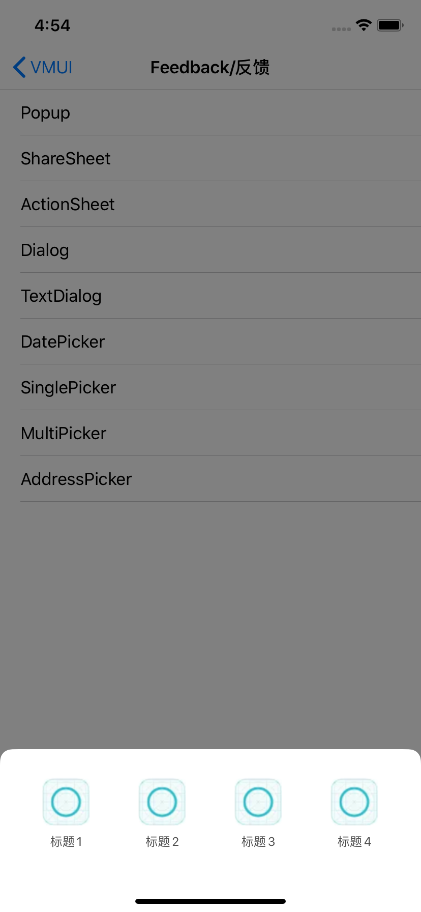

---

title: ShareSheet
date: 2019-11-29 14:28:30
tags:
---
#### 使用示例

```
- (void)ShareSheet{
    NSMutableArray *array = [NSMutableArray new];
    for (NSInteger i = 0; i < 4; i++) {
        VMUIShareSheetTestItem *item = [VMUIShareSheetTestItem new];
        item.itemImageName = @"icon_tabbar_select";
        item.itemTitleName = [NSString stringWithFormat:@"标题%ld",i+1];
        [array addObject:item];
    }
    
    VMUIShareSheet *shareSheet = [[VMUIShareSheet alloc]initWithItem:array delegate:self];
    [shareSheet show:nil];
}

- (void)didSelectItem:(id<VMUIShareSheetItemProtocol>)item sheet:(VMUIShareSheet *)sheet{
    [self.view makeToast:[NSString stringWithFormat:@"选择了%@",item.itemTitleName]];
}
```


#### 主要属性和方法

```java
/// <#Description#>
/// @param items 选项数组
/// @param delegate 回调代理
- (instancetype)initWithItem:(NSArray<id<VMUIShareSheetItemProtocol>>*)items delegate:(nullable id<VMUIShareSheetDelegate>)delegate;


/// <#Description#>
/// @param config UI配置类
/// @param items 选项数组
/// @param delegate 回调代理
- (instancetype)initWithConfig:(VMUIShareSheetConfig*)config item:(NSArray<id<VMUIShareSheetItemProtocol>>*)items delegate:(nullable id<VMUIShareSheetDelegate>)delegate;
```


####预览

