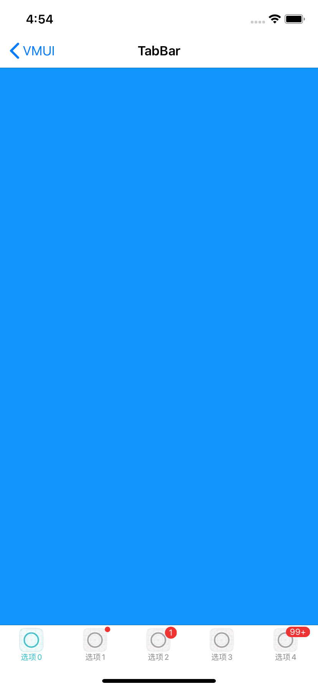

#### 使用方法

```xml
    NSMutableArray *arr_vc = [NSMutableArray new];
    for(NSInteger i = 0; i < 5; i++){
        UIViewController *vc = [[UIViewController alloc]init];
        vc.view.backgroundColor = [UIColor colorWithRed:0x10/255.0 green:0x96/255.0 blue:(0xFA - 40*i)/255.0 alpha:1];
        
        [arr_vc addObject:vc];
        
        UIImage *selectImage = [[UIImage imageNamed:@"icon_tabbar_select"] imageWithRenderingMode:UIImageRenderingModeAlwaysOriginal];
        UIImage *defaultImage = [[UIImage imageNamed:@"icon_tabbar_default"] imageWithRenderingMode:UIImageRenderingModeAlwaysOriginal];
        
        vc.tabBarItem = [[UITabBarItem alloc]initWithTitle:[NSString stringWithFormat:@"选项%ld",i] image:defaultImage selectedImage:selectImage];
        
        tableItem = vc.tabBarItem;
        
        [vc.tabBarItem setTitleTextAttributes:@{NSFontAttributeName:[UIFont systemFontOfSize:10 weight:UIFontWeightRegular],NSForegroundColorAttributeName:RGB(136, 136, 136)} forState:UIControlStateNormal];
        [vc.tabBarItem setTitleTextAttributes:@{NSFontAttributeName:[UIFont systemFontOfSize:10 weight:UIFontWeightRegular],NSForegroundColorAttributeName:RGB(40, 190, 202)} forState:UIControlStateSelected];
    }
    
    self.viewControllers = [arr_vc copy];
    [self.tabBar setBadgeNumString:@"0" forItem:self.viewControllers[1].tabBarItem];
    [self.tabBar setBadgeNumString:@"1" forItem:self.viewControllers[2].tabBarItem];
    [self.tabBar setBadgeNumString:@"99+" forItem:self.viewControllers[4].tabBarItem];
```


#### 主要方法

```
/// 取消所有角标
- (void)cancelAllItemBadge;

/// 设置角标接口
/// @param badgeString 0表示红点 nil或者空字符串清除，其余数字角标
/// @param item <#item description#>
- (void)setBadgeNumString:(NSString *)badgeString forItem:(UITabBarItem *)item;

其余设置UITabBar图片及文本颜色同系统API
```


####预览

