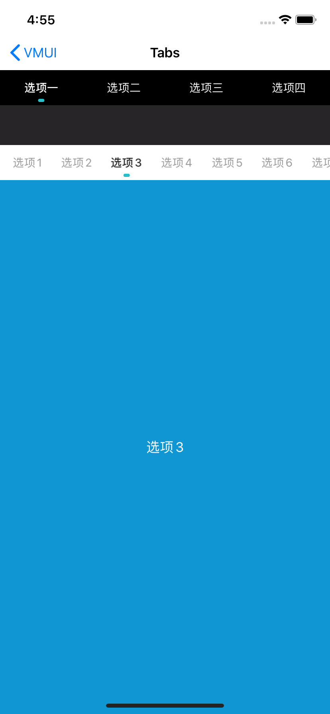
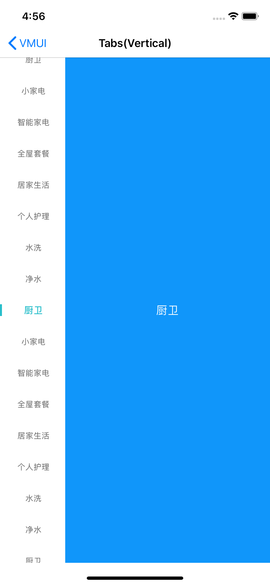

### Tabs的两种类型

#### 一、水平Tabs

#####使用方法

```xml
- (VMUITabLabelView *)labelView{
    if(!_labelView){
        VMUITabLabelViewConfig *config = [VMUITabLabelViewConfig generateByStyle:VMUITabLabelViewStyleDart];
        config.bScrollMode = NO;
        config.font_normal = [UIFont vmui_systemFontOfSize:14];
        config.color_normal = [UIColor whiteColor];
        config.font_selected = [UIFont vmui_mediumSystemFontOfSize:14];
        config.color_selected = [UIColor whiteColor];
        config.color_background = [UIColor blackColor];
        config.bScrollMode = YES;
        config.bAnimation = YES;
        _labelView = [[VMUITabLabelView alloc]initWithConfig:config labels:@[@"选项一",@"选项二",@"选项三",@"选项四"] defaultIndex:0 delegate:self];
    }
    return _labelView;
}

- (void)labelViewDidTap:(VMUITabLabelView *)view label:(NSString *)label index:(NSUInteger)index{
	
}
```

##### 主要属性和方法

| Name     | Type                      | Description                                           |
| -------- | ------------------------- | ----------------------------------------------------- |
| delegate | VMUITabLabelViewDelegate  | 点击回调代理                                          |
| label    | NSArray<NSString *> *     | 标签数组                                              |
| style    | VMUITabLabelViewStyle枚举 | VMUITabLabelViewStyleLight、VMUITabLabelViewStyleDart |
| index    | NSInteger                 | 初始化选中下标                                        |
| config   | VMUITabLabelViewConfig    | UI配置类                                              |

#####UI配置类属性

| Name             | Type    | Description                                                  |
| ---------------- | ------- | ------------------------------------------------------------ |
| font_selected    | UIFont  | 选中的字体                                                   |
| color_selected   | UIColor | 选中的颜色                                                   |
| font_normal      | UIFont  | 未选中的字体                                                 |
| color_normal     | UIColor | 未选中的颜色                                                 |
| color_background | UIColor | 标签栏背景色                                                 |
| bScrollMode      | BOOL    | 是否滚动模式还是自适应模式，滚动模式不受屏幕宽度影响标签大小，自适应模式则会根据屏幕宽度均分标签大小 |
| bAnimation       | BOOL    | 是否开启切换动画                                             |


##### 预览



#### 二、垂直Tabs

#####使用方法

```xml
- (VMUIVerticalTabLabelView *)labelView{
    if (!_labelView) {
        _labelView = [[VMUIVerticalTabLabelView alloc]initWithLabel:@[@"水洗",@"净水",@"厨卫",@"小家电",@"智能家电",@"全屋套餐",@"居家生活",@"个人护理",@"水洗",@"净水",@"厨卫",@"小家电",@"智能家电",@"全屋套餐",@"居家生活",@"个人护理",@"水洗",@"净水",@"厨卫"] defaultIndex:0 delegate:self];
    }
    return _labelView;
}

- (void)labelViewDidTap:(VMUIVerticalTabLabelView *)view title:(NSString *)title index:(NSInteger)index{
    self.label.text = title;
    self.label.backgroundColor = [UIColor colorWithRed:0x10/255.0 green:0x96/255.0 blue:(0xFA - 40*(index%5))/255.0 alpha:1];
}
```


##### 主要属性

| Name     | Type                             | Description    |
| -------- | -------------------------------- | -------------- |
| delegate | VMUIVerticalTabLabelViewDelegate | 点击回调代理   |
| label    | NSArray<NSString *> *            | 标签数组       |
| index    | NSInteger                        | 初始化选中下标 |
| config   | VMUIVerticalTabLabelViewConfig   | UI配置类       |

UI配置类属性

| Name             | Type    | Description  |
| ---------------- | ------- | ------------ |
| font_selected    | UIFont  | 选中的字体   |
| color_selected   | UIColor | 选中的颜色   |
| font_normal      | UIFont  | 未选中的字体 |
| color_normal     | UIColor | 未选中的颜色 |
| color_background | UIColor | 标签栏背景色 |

#####预览



