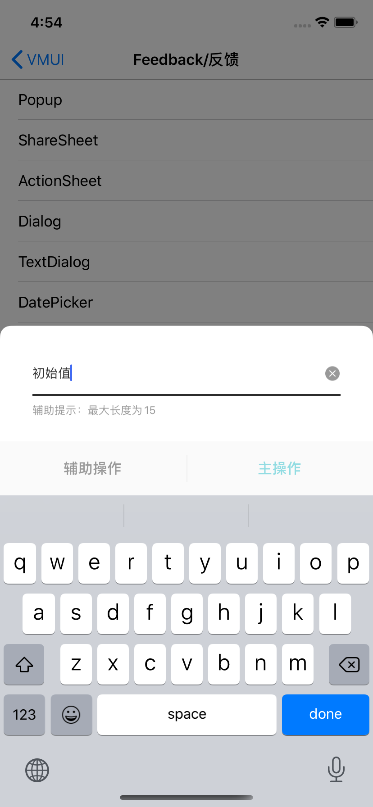

#### 使用示例

```
    VMUITextDialog *textDialog = [[VMUITextDialog alloc]initWithTitle:@"" initialText:@"初始值" placeHolderText:@"请输入商品名称" assistDescText:@"辅助提示：最大长度为15"];
    textDialog.iMaxInputLength = 15;
    textDialog.iMinInputLength = 5;
    self.textDialog = textDialog;
    
    __weak __typeof(self) weakSelf = self;
    [textDialog addOperationItem:[VMUIDialogBarItem itemWithTitle:@"辅助操作" style:VMUIDialogBarItemStyleAssist handler:^(VMUIDialogBarItem * _Nonnull action) {
        __strong __typeof(self) strongSelf = weakSelf;
        [strongSelf.textDialog dismiss:^(VMUIBasePopupView * _Nonnull view) {
            [strongSelf.view makeToast:@"点击了辅助操作"];
        }];
    }]];
    [textDialog addOperationItem:[VMUIDialogBarItem itemWithTitle:@"主操作" style:VMUIDialogBarItemStyleMain handler:^(VMUIDialogBarItem * _Nonnull action) {
         __strong __typeof(self) strongSelf = weakSelf;
        NSString *text = strongSelf.textDialog.sCurrentText;
        if([text isEqualToString:@""]){
            [strongSelf.textDialog makeToast:@"输入不能为空，请重新输入"];
        } else {
            [strongSelf.textDialog dismiss:^(VMUIBasePopupView * _Nonnull view) {
                [strongSelf.view makeToast:[NSString stringWithFormat:@"主操作：输入为%@",text]];
            }];
        }
    }]];
    [textDialog show:nil];
```


#### 主要属性和方法

| Name            | Type      | Description      |
| --------------- | --------- | ---------------- |
| title           | NSString  | 弹窗标题         |
| initalText      | NSString  | 输入框初始字符串 |
| placeHoderText  | NSString  | 输入框占位字符串 |
| assistDescText  | NSString  | 辅助提示字符串   |
| sCurrentText    | NSString  | 获取当前输入值   |
| bAutoFocus      | BOOL      | 是否自动获取焦点 |
| bPassword       | BOOL      | 是否开启安全输入 |
| iMaxInputLength | NSInteger | 最大合法输入长度 |
| iMinInputLength | NSInteger | 最小合法输入长度 |

```
/// 增加操作选型
/// @param item <#item description#>
- (void)addOperationItem:(VMUIDialogBarItem *)item;
```

UI配置类属性同Dialog


####预览

