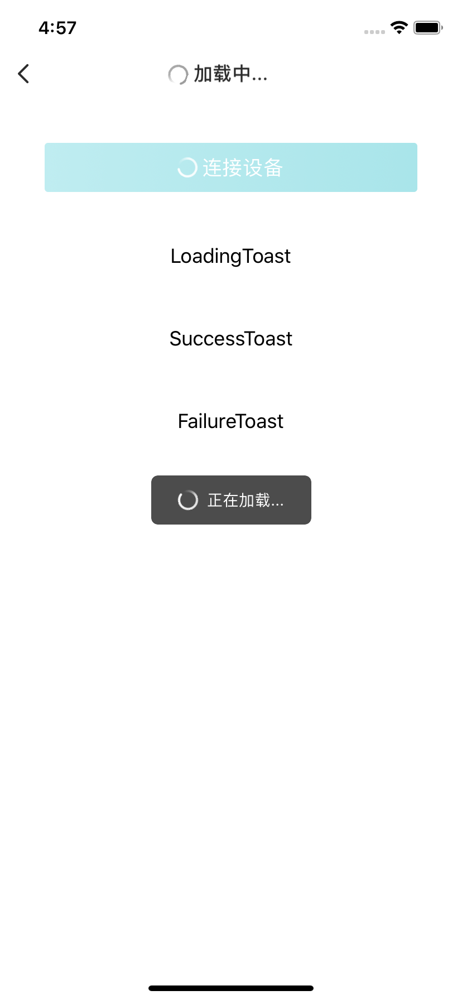

#### 使用示例

```java
self.btn_loading = [[VMUIBtn alloc]init];
[self.btn_loading setTitle:@"连接设备" forState:UIControlStateNormal];
self.btn_loading.bVmuiEnable = NO;
[self.btn_loading displayLoading:YES];
[self.view addSubview:self.btn_loading];

- (void)loadingToast:(id)sender{
    [self.view vm_showLoad:E_VMUIViewLoadingType_Trying message:@"正在加载..." duration:5];
}

- (void)successToast:(id)sender{
    [self.view vm_showLoad:E_VMUIViewLoadingType_Success message:@"加载成功" duration:1];
}

- (void)failureToast:(id)sender{
     [self.view vm_showLoad:E_VMUIViewLoadingType_Failure message:@"加载失败" duration:1];
}
```


####预览

